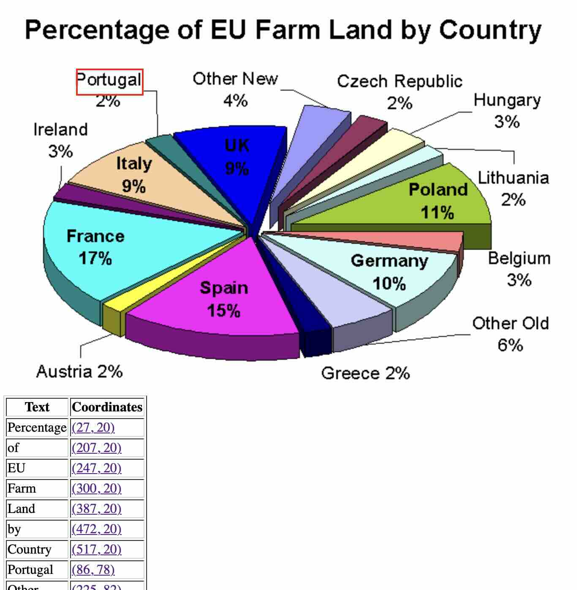

# extract_text.py
Attempts to find text on an image and make
the image searchable by providing links to
the text segments.



## Setup
Create a Python virtual environment and install dependencies.

``` sh
python3 -m venv venv
source venv/bin/activate
pip install pytesseract opencv-python pandas numpy
```

Additionally, Tesseract must be installed on your machine.
Use the argument `--tesseract_path` to specify where the Tesseract executable
is located.

Optionally, verify the installations.

``` sh
tesseract --version
python -c "import cv2; import pytesseract; import pandas; print('All packages are installed successfully!')"
```

## Usage
The script requires the path to an image file
as a command line argument.

``` sh
python extract_text.py assets/FarmlandinEU2.png
```

The output will be written to `output.csv` (a table of the text 
that has been found and the corresponding corrdinates)
and `output.html` (an HTML page displaying the image and 
links that will highlight the corresponding text when clicked).

Here's a list of the optional command line arguments:

| Argument | Description | Default value |
|----------|-------------|---------------|
| `--tesseract_path` | Location of the Tesseract binary | `/opt/homebrew/bin/tesseract` |
| `--output_csv` | Specifies the path to the output CSV file. | `output.csv` |
| `--output_html` | Specifies the path to the output HTML file. | `output.html` |
| `--confidence_threshold` | Sets the threshold value (ranging from 0 to 100) for text segmentation. Text segments with confidence scores below this threshold will be ignored. | `60` |